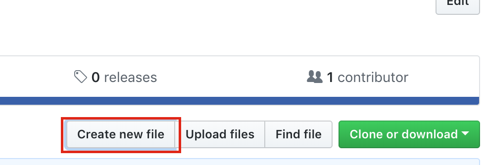
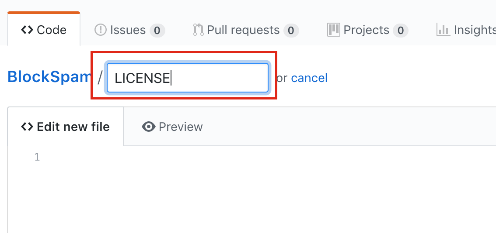
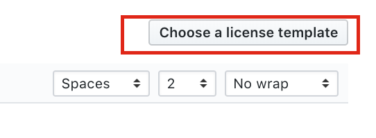
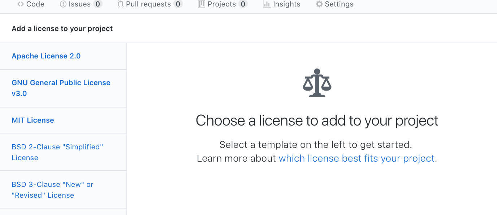
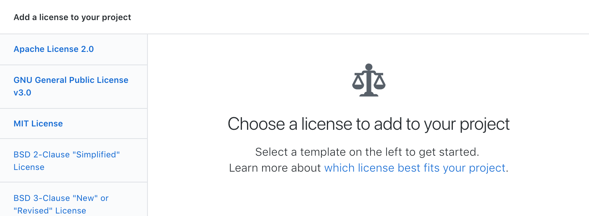
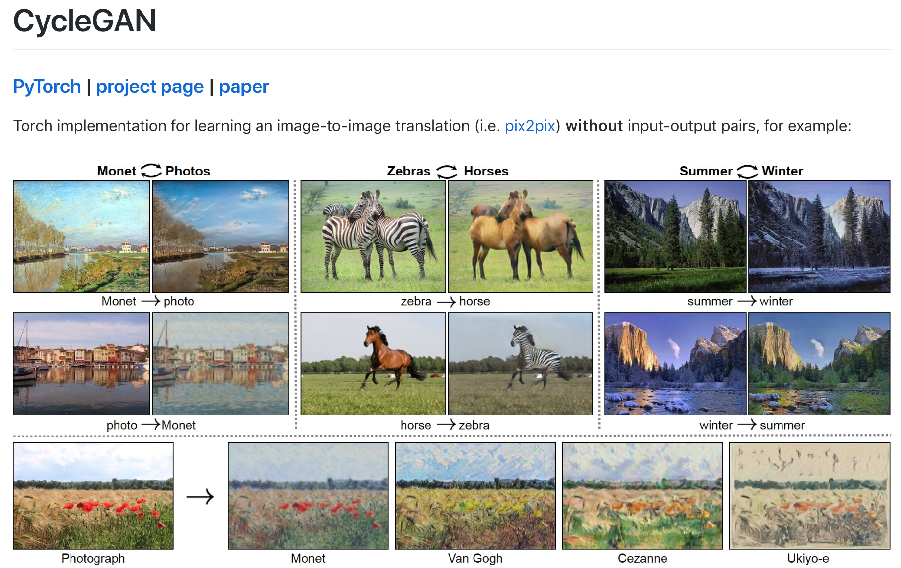
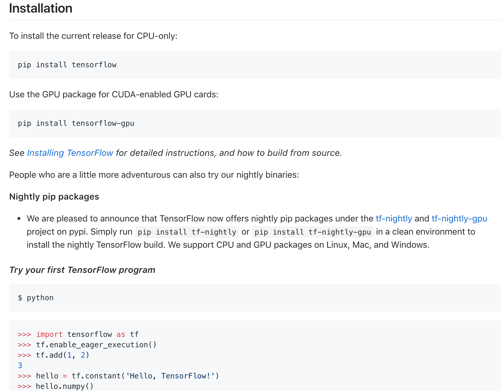
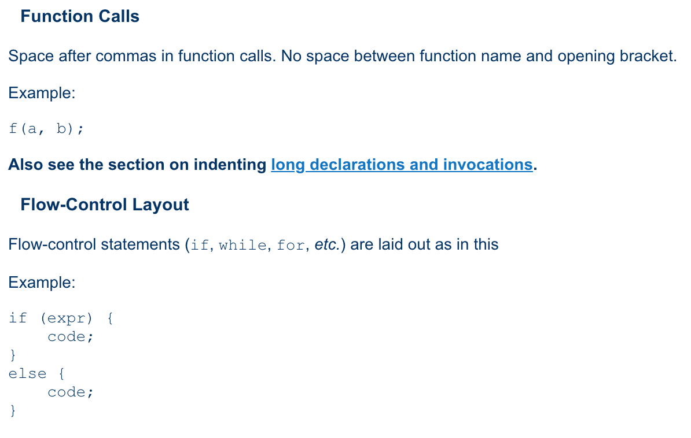

## Github Document Guide

이 문서는 깃헙에서 오픈소스 프로젝트를 공개할 때 필요한 문서들을 작성하는 방법을 담은 가이드 입니다.

### LICENSE 문서

LICENSE 문서는 이 프로젝트가 오픈소스 라이센스를 따르고 있어 많은 사용자들이 사용, 수정, 배포를 할 수 있다고 알리는 기능을 가지고 있습니다. 따라서 모든 오픈소스 프로젝트의 레포지토리 최상위 폴더 안에 LICENSE문서를 포함해야 사용자들이 프로젝트가 어떤 라이센스를 따르는지 쉽게 알 수 있습니다.

Github에서는 오픈소스 프로젝트에 오픈소스 라이센스 명시를 쉽게 할 수 있도록 LICENSE문서에 자동으로 여러 오픈소스 라이센스 템플릿을 생성해주는 기능을 가지고 있습니다.

1. Github 레포지토리 페이지에서 `Create new file` 을 누릅니다.

2. 파일이름을 적는 부분이 `LICENSE` 혹은 `LICENSE.md`로 파일명을 지정해 줍니다.

3. 파일 이름을 적은 후 오른쪽 상단에 생긴 `Choose a license template` 버튼을 눌러줍니다.

4. 왼쪽에 보이는 오픈소스 라이센스 리스트 중 원하는 라이센스를 골라준 후 오른쪽에 있는 `review and submit`버튼을 눌러줍니다.

5. 그 후 템플릿에 맞춰 라이센스 파일이 생성되면 커밋버튼을 눌러 파일을 레포지토리에 올려줍니다.

---

### README 문서

README문서는 한 오픈소스 안에서 대문같은 존재입니다. README파일을 마크다운 형식으로 Github 레포지토리의 최상위 폴더에 올려두게 되면 해당 레포지 토리에 들어갔을 때 해당 내용이 제일 먼저 보입니다. 그렇기 때문에 이 오픈소스 프로젝트를 사용하는 사람들에게 필요한 정보를 담아야 합니다. 

#### 마크다운 사용법

깃허브에서 사용하는 마크다운으로 글을 작성하는 방법을 더 알아보고 싶다면 [Markdown Guide](https://www.markdownguide.org/) 이 링크의 문서를 참조해서 작성하면 됩니다.

README에는 다음 4가지가 최소한 담겨 있어야 합니다.

#### 1. 이 프로젝트가 어떤 프로젝트인지

이 프로젝트를 처음 접하는 사람은 이 프로젝트에 대한 정보를 가지고 있지 않습니다. README에서 어떤 정보를 찾아야 하는지 이정표 같은 역할을 할 수 있도록 작성해야합니다. 그렇기 때문에 처음 접하는 사람에게 효과적으로 이 프로젝트에 대해 설명하는것이 주 목적입니다.

프로젝트를 잘 설명하고 싶다면 다음과 같은 관점에서 프로젝트를 설명하면 좋습니다.

- 이 프로젝트가 무슨 프로젝트인지
- 이 프로젝트가 어떻게 작동하는지
- 이 프로젝트를 어떻게 쓰는지
- 이 프로젝트의 목적은 무엇인지
- 이 프로젝트를 사용함으로써 어떤 이점을 얻을 수 있는지

위와 같은 기준으로 문서를 작성하게 되면 처음 보는 사용자들이 이프로젝트에 대해 잘 알 수 있게 됩니다.

주의해야할 점은 코드 문서화랑 README는 분리해야합니다.  README문서는 사람들이 필요한 정보를 찾을 수 있도록 보조하는 역활이지 모든 내용을 담는 공간이 아닙니다. README에는 큰 관점에서 이 프로젝트가 어떻게 동작하는지를 서술해두고 자세한 내용을  코드 문서화에서 찾을 수 있도록 링크를 걸어 넘어갈 수 있도록 해야합니다.

#### 2. 어떻게 사용하고 설치하는지. 

오픈소스 프로젝트는 소스코드를 공개할 뿐만 아니라 소프트웨어를 사용할 수 있게 해야합니다. 처음 쓰는 사람들이 이 프로젝트를 사용할 수 있는지 혹은 기여하고 싶은 사람이 어떻게 프로젝트를 빌드해야할지를 작성해야 합니다.

   

   프로젝트 성격에 따라서 아래 리스트중 필요한 부분을 포함해 작성하면 됩니다.

1. API 사용방법

   프로젝트가 라이브러리 형태 혹은 웹 API를 가지고 있다면 간단한 예제 코드를 통해 이 API를 어떻게 사용하는지에 대한 설명을 해주는 것이 좋습니다. 예제코드에는 간단한 주석을 통해 API의 반환값등을 적어주거나 어떻게 작동하는지에 대한 설명을 간단하게 작성해놓으면 조금더 이해하기 쉬워집니다. 자세한 API 사용방법은 별도의 문서를 통해 설명을 하고 해당 문서를 링크를 걸어둡니다.		

2. 설치

   프로젝트를 사용하기 위해 필요한 설치 방법을 기술합니다. 처음 접해보는 사람이더라도 서술한 방식대로 따라가면 프로그램을 사용할 수 있도록 작성해 둡니다. 또한 프로젝트를 사용하기 위해 필요한 실행 인자 혹은 의존성 라이브러리가 있다면 같이 작성해둡니다. 설치 후 테스트 할 수 있는 테스트코드가 있다면 테스트 코드를 실행 할 수 있는 방법을 같이 작성해둡니다.

#### 3.어떤 경로로 도움을 받을 수 있는지

아무리 설명을 잘 써뒀다고 해도 종종 도움이 필요한 경우가 생깁니다. 코드에 기여를 하는 방법 혹은 프로젝트에 대한 질문 사항이 있을 수 도 있습니다. 

- 어떻게 하면 이 프로젝트에 컨트리뷰트 할 수 있는지 (Contribute.md)
- 도움을 받을수 있는 공간 (IRC, Slack or Google Group)
- 메인테이너가 소수 라면 물어볼 수 있는 연락처

#### 4. 오픈소스 라이센스

오픈소스 프로젝트를 다른 사람들이 자유롭게 수정 및 사용, 배포 하려면 오픈소스 라이센스를 포함해야합니다. 이 프로젝트가 어떤 라이센스를 사용하는지를 문서 맨 하단에 넣어주어야 합니다. 이 와는 별개로 레포지토리 안에 LICENSE 파일을 포함하는것이 좋습니다.

#### 더 나은 README를 쓰고 싶다면

더 나은 README를 작성하고 싶다면 잘 작성된 문서들을 읽어본후 참고하는 방법도 있습니다.

- https://github.com/github-changelog-generator/github-changelog-generator
- https://github.com/jakubroztocil/httpie

맨 처음 README를 빈 화면부터 쓰는것이 부담스럽다면 [README TEMPLATE](https://gist.github.com/PurpleBooth/109311bb0361f32d87a2) 을 사용해서 관련된 내용을 채워가는 방법도 있습니다.

---

### CONTRIBUTING 문서

CONTRIBUTING문서는 프로젝트에 기여하고 싶은 사람에게 우리가 어떻게 일을 하는지를 가르쳐줍니다. 문서에는 아래 3가지 내용이 포함되어야 합니다.

1. 프로젝트를 빌드&테스트 하는 방법

   위에 README 파트에서 자세하게 작성해 두었다면 추가적으로 작성할 필요가 없을 수 도 있습니다. 하지만 사용법만 작성을 해 두었다면 프로젝트에 기여하고 싶은 사람이 소스코드를 가지고 어떻게 빌드를 해야하는지, 소스코드를 추가한 다음 어떻게 테스트 코드를 돌리는지를 반드시 명시해 두어야 합니다.

2. 프로젝트에 기여하는 방법

   맨 처음 오픈소스 프로젝트를 개발한 사람들 끼리는 어떤 종류로 일을 하는지 알고 있지만 처음 접한 사용자들은 모릅니다. 그렇기 때문에 프로젝트에서 어떤 종류의 기여를 받는지를 작성해둬야합니다.
   프로젝트에 기여하는 방법은 여러가지가 있습니다. 

   - 버그 리포팅
   - 개선점 제안 (Suggesting Enhancements)
   - 문서 번역
   - 코드 기여

   

   각각 기여에 대해서 어떤 형식으로 기여를 받는지를 기술해두는 것도 중요합니다. 예를 들어 코드를 기여받을 때 제일 중요한 것들은 프로젝트에서 사용하는 **코딩 컨벤션**을 맞추는 일 입니다. 오픈소스 프로젝트의 경우 많은 사람들이 함께 작업하기 때문에 다른 사람이 작성한 코드를 읽거나 수정해야하는 일이 발생합니다. 그렇기 때문에 서로 코딩 컨벤션을 맞춰야 추가적인 비용소모를 막을 수 있습니다.

   조금 규모가 큰 회사 혹은 프로젝트의 경우 자체적인 코딩 컨벤션이 존재하지만 중소 규모의 프로젝트에서 별도로 코딩 컨벤션을 명시해 둘 때에는 이미 존재하는 코딩 컨벤션을 사용하는것도 하나의 방법이 될 수 있습니다. 예를 들어 [google C++ style Guide](https://google.github.io/styleguide/cppguide.html), [python pep8](https://www.python.org/dev/peps/pep-0008/), [apache c lang style guide](http://httpd.apache.org/dev/styleguide.html), [Mozila coding style](https://developer.mozilla.org/en-US/docs/Mozilla/Developer_guide/Coding_Style) 등등 다양한 코딩컨벤션을 사용하면 됩니다.

   코딩 컨벤션 이외에도 CONTRIBUTING 문서의 좋은 예제인 [Atom CONTRIBUTING.md](https://github.com/atom/atom/blob/master/CONTRIBUTING.md) 를 보게 되면 각각 기여하는 방법에 대해 자세히 설명하고 있는 부분들을 볼 수 있습니다.

---

### 이 문서의 저작권 
</img> 
이 문서는 크리에이티브 커먼즈 저작자표시 2.0 대한민국 라이선스에 따라 
누구나 이용할 수 있습니다.

[CC-BY-NC-SA 2.0 (Creative Commons License Attribution-NonCommercial-ShareAlike)](https://creativecommons.org/licenses/by-nc-sa/2.0/): 
비상업적으로 공유하신다면 별도의 허가는 필요없고, 출처만 밝히시면 됩니다.
문서를 수정하거나 변형하여 공유해도 됩니다만, 반드시 같은 CC-BY-NC-SA
저작권을 적용하시는 조건입니다.